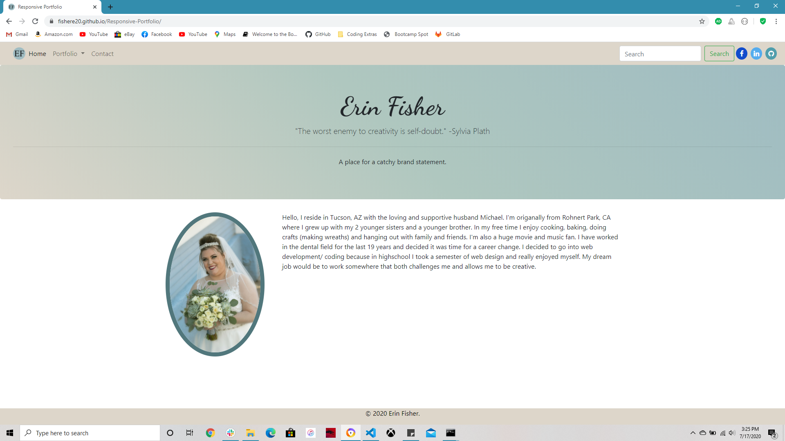

# Responsive-Portfolio




>Website thats contains out portfolio and resume

---

### Table of Contents

* [Description](#description)
* [How To Use](#how-to-use)
* [References](#references)
* [License](#license)
* [Author Info](#author-info)

---

## Description
This assignment is the start of what will become my portfolio. It is to be a mobile first design. Be responsive to differnt viewing platforms, from cellphone to desktop computers. With that idea in mind I wanted to design a project that reflexs me. In school I can alot of art classes and I wanted to implement some of the color and design theories into my project.

When I start a design I think about the look and feel that I want to project. Since this is the start of my portfolio I wanted the look be nautuarl in tone with calming colors. This allows the view to transition through each componet without being distracted by jarring colors.

My next step was deciding how I wanted the viewer to navagate through the web page. I decided to place a navagation bar that had everything in one location. On the left hand side would be the different pages: Home, Portfolio, & contact. This is followed by a search icon and finally links to my social media accounts (facebook, linkedin, github). This navagation bar in on each of the pages for a consistent and unified look to the project as a whole. 

In this same regard for the portfolio page. I chose to add images to the card display for the projects instead of placeholder text. The images I chose were based on the common colors and hues to the over all look of the project.


---


#### Technologies

- HTML
- CSS
- Favicon


---

## How To Use
Type https://fishere20.github.io/Responsive-Portfolio into your browser, you'll then be directed to the website.


#### Installation
none


#### API Reference
none

```html
    <p>dummy code</p>
```
[Back To The Top](#Responsive-Portfolio)

---

## References
- GitHub - [fishere20](https://fishere20.github.io/Responsive-Portfolio)
- Website - [fishere20](https://fishere20.github.io/Responsive-Portfolio) 

[Back To The Top](#Responsive-Portfolio)

---

## License


Copyright(c) [2020] [Erin K Fisher]

[Back To The Top](#Responsive-Portfolio)

---

## Author Info

- GitHub - [fishere20](https://fishere20.github.io/Responsive-Portfolio)
- Website - [fishere20](https://fishere20.github.io/Responsive-Portfolio) 

[Back To The Top](#Responsive-Portfolio)

